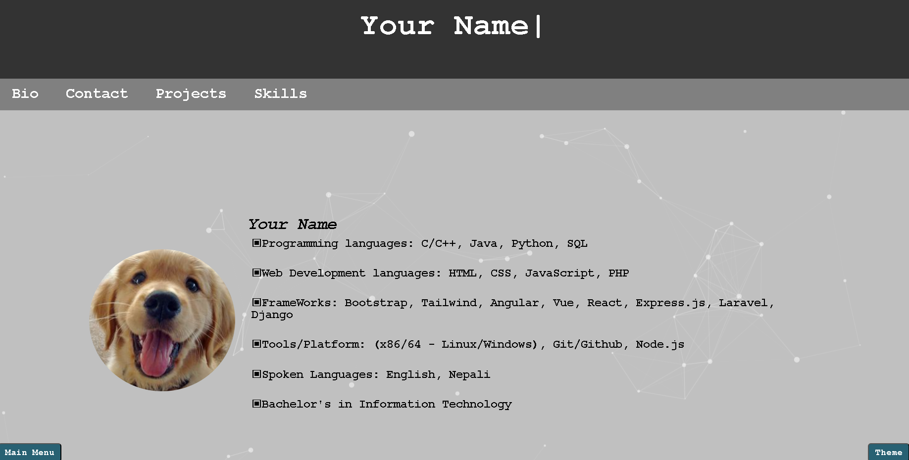
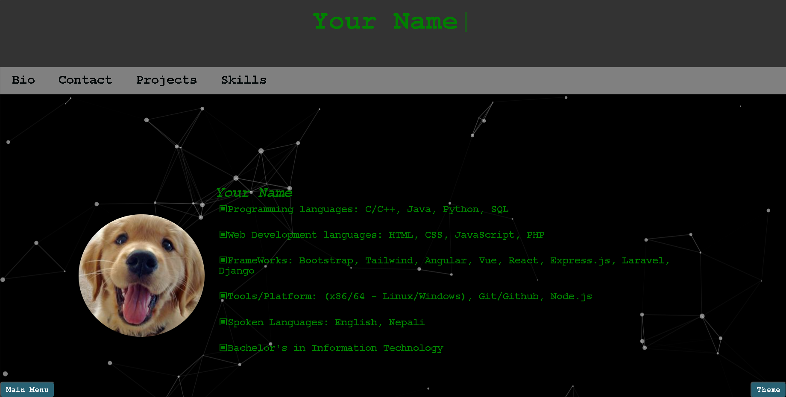
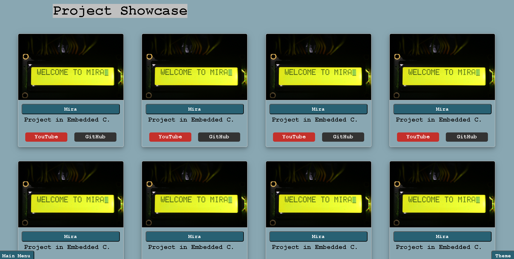
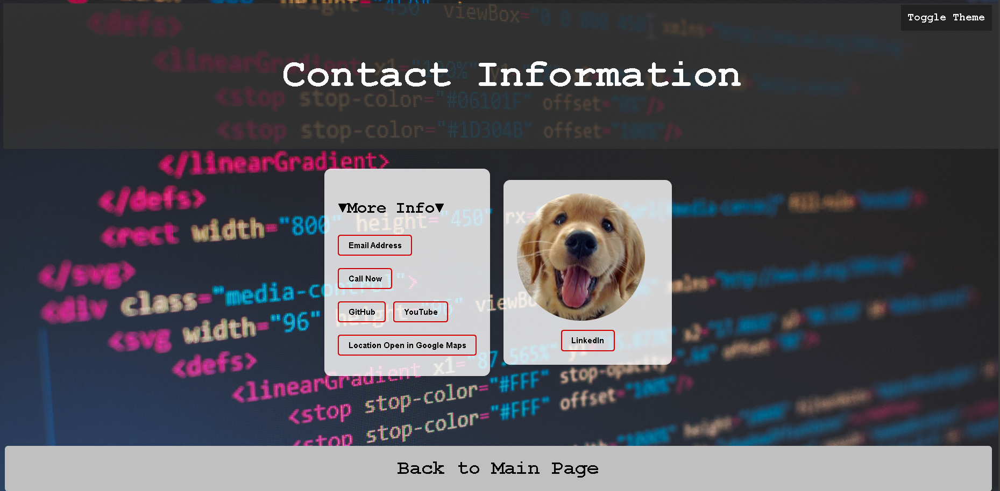
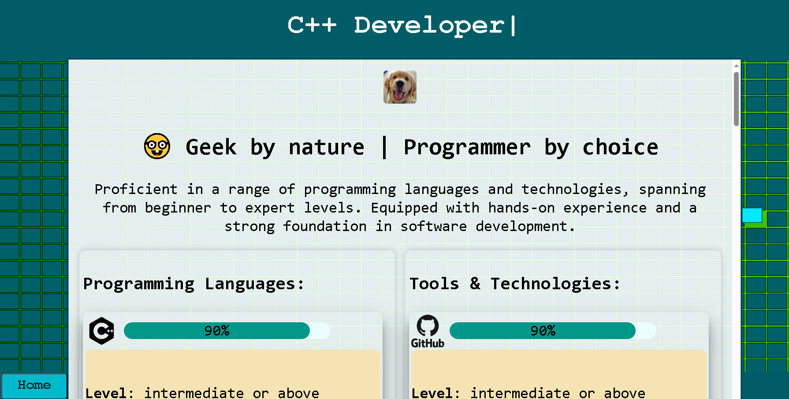

# `Creative Coder Portfolio`
---
Welcome to my portfolio project! This project is designed to help you create your own portfolios using HTML, CSS, and JavaScript. Feel free to use it as a starting point for your portfolio.
If you want the beauty of plain vanilla than you are at the right place.

## `Features:`

- **Responsive Design:** The portfolio is designed to be responsive and work well on various devices.
- **Interactive Sections:** Use of JavaScript to add interactivity to your portfolio.

## `Screenshots:`

## `Getting Started:`

1. **Clone the Repository:**
   - `git clone https://github.com/iceman404/Creative-Coder-Portfolio.git`
   
2. **Navigate to the Project Directory:**
   - `cd Creative-Coder-Portfolio`
   
3. **Open index.html in your Browser:**
   - Open the `index.html` file in your preferred web browser to view the portfolio.

## `Modifications:`

### `HTML (index.html)`

#### Header Section
   - **Update the title/description in the relevant tag.**
   - **Add your name in the header to be displayed in the relevant function.**
   - **Update or add navigation links in the nav section.**

#### Bio Section
   - **Replace relevant content with your personal information.**

#### Projects Section
   - **Project html files and screenshots are in the project-html-files and project-screenshots-files respectively.**
   - **Update project details, images, and links.**
   - **You can add or remove projects as needed.**

#### Contact Section
   - **Update your contact information or social media links in relevant places.**

#### Skills Section
   - **For changing the background color you can combine from a list of your 4 colors to give the glow effect from the margin gaps.**
   - **For displaying the name typing effect you can add your desired names in the name lists.**
   - **Hover tiles are hardcoded for increasing the responsiveness of page.**
   - **Download Resume takes the pdf file from the resume directory.**
   - **Update your skills in the skills.html file. Pre tag is used so when adding skills description put no more than 3 words in 1 line.**
   - **Logos are in the assets directory.**

### `CSS (styles.css)`

#### Styles
   - **Customize the styles to match your design preferences. All styles are internal for ease of customization, except the one used by particle.js which is in the css/ directory.**

### `JavaScript (script.js)`

#### Scripts
   - **All functions are in internal scripts for ease of use, except for particle.js which is in the parent directory, and its app.js library in particle.js/ directory.**

#### Interactive Elements
   - **Add or modify JavaScript functions to enhance interactivity.**

---
## `Contacts:`

If you have any questions or need further assistance, feel free to reach out:
   Experience section is not added at this version. But it can be added as another nav link with experience html file.

- **Name: **
- **Email: **
- **LinkedIn: **
- **Twitter: **

---

Happy coding! 🚀
